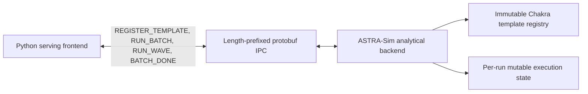

# Chakra Template IPC Completion Plan

This document is the execution plan for completing and evaluating the Chakra
template IPC work. It replaces the earlier design diary with a shorter record
of the current architecture, verified results, remaining risks, and benchmark
gates.

The optimization does **not** replace Chakra with a new graph format. Chakra
remains the static workload-graph representation. The new protocol registers a
Chakra graph template once and sends only batch-dependent values for later
executions.

## Goal

Remove recurring host overhead from the analytical simulator without changing
the simulated result.

The old steady-state path is:

```text
schedule batch
  -> generate a full text trace
  -> start a Chakra converter process
  -> write per-NPU .et files
  -> make ASTRA-Sim reopen and parse the graphs
  -> poll until the batch completes
```

The target path is:

```text
startup
  -> start Python and ASTRA-Sim once
  -> build and register immutable Chakra templates

each iteration
  -> schedule a batch or DP wave
  -> calculate only changed durations and tensor sizes
  -> send a compact patch in memory
  -> create fresh runtime state from the registered template
  -> receive one correlated BATCH_DONE event
```

Topology, network, system, and memory configuration files remain startup-only
inputs. They are not regenerated per batch and are not a material recurring
cost in this project.

## Process and data model

Two long-lived processes participate in normal analytical execution:



The three important objects are:

| Object | Lifetime | Contents |
| --- | --- | --- |
| Topology configuration | Whole simulator process | NPU count, links, bandwidth, memory configuration |
| Chakra template | Many batches | Nodes, dependencies, node types, memory locations, collective kinds and dimensions |
| Batch patch | One batch or wave | Computation times, tensor sizes, communication sizes, migration sizes, enabled state |

ASTRA-Sim must never execute the registered protobuf object directly because
the legacy feeder removes nodes and dependency edges as execution progresses.
Every run therefore receives new mutable dependency counts, ready queues,
patched values, and issued/completed state backed by the immutable template.

## Submission semantics

`RUN_BATCH` and `RUN_WAVE` use the same template and patch representation. The
difference is when execution may begin.

### Independent batch

`RUN_BATCH` submits one logical instance. TP, PP, and local EP ranks belonging
to that instance are included in one template bundle. ASTRA-Sim validates the
entire patch and may start the instance immediately.

### Synchronized DP wave

`RUN_WAVE` submits every real or dummy participant required for a cross-instance
DP+EP collective. Python first synchronizes the batch lengths and collective
size. ASTRA-Sim then validates all participants before installing any of them.
If one participant is invalid, the whole wave is rejected and no participant
may reach a collective alone.

### Why more than one template can exist

Batch width normally changes durations and sizes, not graph structure, so it
reuses the same template. A separate template is required only when operations
or their order change, for example:

- compute versus KV eviction or reload;
- colocated versus prefill/decode roles;
- PIM channel/request shape;
- MoE or pipeline structure;
- sub-batch interleaving; or
- placement that changes emitted memory operations.

These variants are created lazily and stored in a bounded LRU cache. Eviction
removes the Python-side compiled bundle; the registered backend template ID is
retained so a later use can rehydrate the bundle without registering stale or
conflicting dynamic values.

## Current status

Status date: **2026-07-22**.

| Area | Status | Evidence or remaining gate |
| --- | --- | --- |
| Host-stage timing and counters | Implemented | Cold/warm stages, messages, bytes, registrations, hits, misses, evictions |
| In-process Chakra conversion | Implemented | File compatibility mode no longer requires a converter subprocess when selected |
| Structured trace plan | Implemented | Cache-hit direct batches can skip text rendering and parsing |
| Compiled profile cache | Implemented | Fingerprinted, versioned, compressed, and invalidated by source changes |
| Template registry and runtime-state split | Implemented | Repeated direct execution uses immutable templates and fresh state |
| `RUN_BATCH` | Implemented | Dense, TP, PP, PD, local-EP, PIM, and migration regressions completed |
| `BATCH_DONE` | Implemented | Direct execution no longer sends repeated `PASS` polling traffic |
| `RUN_WAVE` | Implemented and rejection-tested | Ten-session DP+EP oracle/direct runs are exact; two repeated pairs have identical 60-wave patch digests; a real-socket C++ test proves atomic rejection and connection recovery |
| Bounded template cache | Implemented | Capacity validation and LRU eviction tests added; capacity-2 PIM run exercised rehydration |
| Event-driven analytical loop | Implemented and rebuilt | Both analytical backends block for IPC instead of deriving virtual time from host latency; tool gaps use `ADVANCE_TIME` |
| Structural regression | Complete for the selected matrix | Dense TP1/TP2, PP, chunked prefill, PD, local EP, DP+EP, PIM, sub-batch PIM, session KV, and agentic modes passed their selected exact oracle |
| Repeatable benchmark runner | Implemented | Isolated `cdcc8aa`, current file/oracle/direct, cold/warm caches, resources, input hashes, alternating order, and aggregate JSON |
| Multi-session measurement | Implemented | Seeded sequential/moderate/burst workloads; realized live/runnable concurrency and idle/tool-gap metrics |
| Compact patch encoding | Implemented | Slot/value pairs use packed protobuf integers while the legacy representation remains readable |
| Default transport decision | Analytical defaults to IPC/direct | Dense-100 and agentic-50 repetition gates, current-oracle correctness, and 100/300-session RSS gates are closed; ns-3 remains file-only |

The Python test suite currently contains 22 graph-pipeline tests. It covers
framing, template/patch behavior, compiled-cache invalidation, LRU eviction,
host metrics, agentic concurrency, and related helpers. End-to-end equivalence
remains the authoritative gate.

## Results recorded so far

Results below are reproducible artifacts, but only entries explicitly marked
five-run satisfy the final headline repetition rule.

| Comparison | Runs | Host wall result | Correctness |
| --- | ---: | ---: | --- |
| `cdcc8aa` / direct, dense 1 request | 5 per mode | 9.62x median speedup | Exact request CSV and final clock |
| `cdcc8aa` / direct, dense 3 requests | 5 per mode | 15.22x median speedup | Exact request CSV and final clock |
| `cdcc8aa` / direct, dense 100 requests | 5 per mode | 14.72x median (241.876 s → 16.432 s) | Exact request CSV and final clock in all runs |
| `cdcc8aa` / direct, agentic 10 sessions | 5 per mode | 9.03x median speedup | Baseline virtual time differs because `ADVANCE_TIME` fixes host-latency leakage; not correctness-qualified against the old commit |
| current oracle / direct, PD 10 sessions | 5 per mode | 1.99x median (4.013 s → 2.015 s) | Exact CSV and clock in all runs |
| current oracle / direct, local-EP 533 batches | 1 per mode | 4.70x | Exact CSV and clock |
| current oracle / direct, DP+EP 10 sessions | 5 per mode | 2.72x median (6.667 s → 2.450 s) | Exact CSV, clock, and wave digest in all runs |
| current oracle / direct, session KV 10 sessions | 5 per mode | 2.12x median (3.709 s → 1.753 s) | Exact request and KV sidecar hashes in all runs |
| current file / direct, agentic 100 sessions | 1 per mode | 6.87x | Exact CSV and clock; resource-split run |
| `cdcc8aa` / direct, agentic 50 sessions | 5 per mode | 28.83x median timing ratio (70.079 s → 2.431 s) | Historical timing only: old host-delay clock bug changes the fingerprint |
| current file / direct, agentic 50 sessions | 5 per mode | 4.60x median (11.183 s → 2.431 s) | Exact request CSV and final clock in all runs |

Current direct cache hit rate improves from 98.33% at 10 sessions to 99.83%
at 100 sessions for the same compute-template class. Direct mode creates only
the bootstrap trace/graph: the 100-session run skipped 599 recurring graph
conversions and trace files.

## Closed risks and retained limitations

1. The apparent direct-mode RSS growth was an unbounded Python list retaining
   every ASTRA-Sim stdout line. A bounded 256-line diagnostic tail removes the
   growth. In the post-fix 100-session pair, direct peak RSS was 85,632 KiB
   versus file at 89,732 KiB. Direct current RSS stays approximately flat from
   10 through 300 completed sessions; the backend stays near 10 MiB.
2. All sequential, moderate, and burst agentic-50 probes expose the old
   commit's host-delay clock bug. The old-commit 28.83x number is therefore a
   historical host-time ratio, while the current file/direct 4.60x result is
   the five-run correctness-qualified graph-pipeline speedup.
3. The file controller is retained for independent compatibility/debug runs.
   DP+EP file execution is intentionally rejected because it cannot provide
   atomic cross-instance installation; IPC oracle is the synchronized oracle.

## Remaining work

### Phase 1: Stabilize the shared event loop

**Status: complete.** Both binaries build, the 22 tests pass, PD overlap and
final shutdown complete, and IPC no longer advances time based on host delay.

1. Inspect the latest changes in both congestion-aware and
   congestion-unaware analytical mains.
2. Build both analytical binaries in the simulator image.
3. Run Python syntax checks, the 22 graph-pipeline tests, and whitespace
   checks.
4. Re-run a minimal dense file/direct pair to catch basic command-order
   regressions.
5. Re-run PD and local-EP pairs that previously triggered the polling storm.
6. Re-run the single-node DP+EP oracle pair and malformed-wave rejection test.

Exit gate:

- no busy polling or unbounded `PASS` traffic;
- no deadlock during bootstrap, pipeline handoff, dummy DP participation, or
  final shutdown;
- exactly one logical completion per submitted run; and
- identical simulated results against the appropriate file or IPC oracle.

### Phase 2: Close structural correctness coverage

**Status: complete.** The scenario matrix has been exercised; synchronized
cases use IPC oracle because legacy file submission is not atomic. The
`WorkloadIpcAtomicityTest` executable sends a valid participant plus an invalid
participant over a real Unix socket, verifies that neither is installed and no
completion is emitted, and then proves that a valid request still succeeds on
the same connection.

Run deterministic file/direct equivalence for:

| Scenario | Required checks |
| --- | --- |
| Dense TP=1 and TP>1 | Request CSV, batch clocks, AllReduce sizes |
| Pipeline parallel | Rank ownership, transfer order, final clock |
| Chunked prefill and decode | Batch transitions and attention patch values |
| Prefix caching | Computed tokens and tensor sizes |
| KV eviction and reload | Memory locations, byte counts, migration duration |
| Prefill/decode split | Handoff order and paired-system wakeups |
| Local-EP MoE | Per-rank expert work and collective order |
| DP+EP MoE | Atomic membership, padding, dummy batches, collective size |
| PIM attention | Channel assignment, node order, duration |
| PIM sub-batch interleaving | Batch tags, ordering, overlap semantics |
| Agentic deferred sessions | Tool-gap idle advancement and turn release times |

Every pair records a correctness fingerprint containing:

- scheduled batch sequence;
- per-batch simulated cycles and exposed communication cycles;
- final simulation clock;
- completed request, turn, and session counts;
- per-request arrival, first-token, completion, and latency values;
- prompt and generation token totals;
- migration and cache counters; and
- final memory accounting.

Exit gate: every supported analytical mode is exact, or a deviation is
explained and approved before performance results are accepted.

### Phase 3: Add a repeatable benchmark harness

**Status: complete.** The runner is
`scripts/benchmark_chakra_pipeline.py`; resource collection is performed by
`scripts/benchmark_support/run_with_resource.py`.

Create one runner that:

- builds and runs the previous implementation from isolated commit `cdcc8aa`;
- runs the current file/oracle and current IPC/direct modes;
- records exact commands, commit/dirty state, input hashes, image ID, and run
  order;
- creates unique output directories without sharing generated graphs;
- separates first-ever cold startup from compiled-cache-hit restart;
- parses host timing and transport counters into machine-readable JSON/CSV;
- computes correctness fingerprints before including a timing result; and
- produces median, IQR, minimum, maximum, and speedup summaries.

The baseline worktree and current tree must build separate ASTRA-Sim binaries.
They may share the source workload and cluster configuration only after their
hashes are recorded.

### Phase 4: Run the performance campaign

**Status: complete.** Dense 1/3/100 and agentic 10/50 have five-run results.
The agentic-50 old-commit ratio is separated from the exact current
file/direct comparison because of the old clock bug.

Each timed pair receives one untimed warm-up and at least five alternating
measured runs. Use a fixed seeded order such as:

```text
baseline, direct, direct, baseline, baseline, direct, ...
```

The mandatory headline set is:

| Workload | Scale points | Purpose |
| --- | --- | --- |
| Dense flat serving | 1, 3, and 100 requests | Startup, changing batch width, long reuse |
| Agentic sessions | 1, 10, and 50 sessions | Turn dependencies, tool gaps, realized concurrency |
| Prefill/decode sessions | 10 sessions | Multi-system handoff and completion events |
| Session KV retention | 10 sessions | Compute plus eviction/reload templates |
| DP+EP MoE sessions | 10 sessions | Atomic waves and dummy participants |

Dense, agentic, and DP+EP produce headline repeated speedups. PP, local EP,
PIM, sub-batch PIM, and migration remain mandatory correctness gates and are
repeated only if their stage timings show a regression.

The resource-attribution gate was closed with the following procedure:

1. record Python current RSS immediately before template registration, after
   registration, after 10/50/100/300 completed sessions, and at shutdown;
2. record ASTRA-Sim current RSS at the equivalent backend checkpoints;
3. run file and direct in alternating order with the same prewarmed profile
   cache and input hash;
4. report both raw process peak and incremental RSS above the post-startup
   checkpoint; and
5. use allocation tracing only around template creation and patch submission
   if the incremental curve continues to grow.

Allocation tracing identified the background controller's unbounded stdout
list. Replacing it with a bounded tail reduced the 100-session direct peak from
about 107 MiB to 85.6 MiB. A 300-session run remains approximately flat near
90 MiB after template registration, so the ten-percent gate is satisfied.

After resource attribution, run a one-pair agentic-50 probe for each seeded
profile. Select a profile whose previous-commit and current fingerprints are
exact for the headline five-run comparison. If none is exact because of the
old clock bug, retain the old-commit timing as a clearly labelled historical
speed measurement and use current file/direct five-run equivalence as the
correctness-qualified agentic result.

### Multi-session profiles

Session count and overlap are independent dimensions. For 10 and 50 sessions,
run at least:

| Profile | Arrival rate | Tool-gap character | What it stresses |
| --- | ---: | --- | --- |
| Sequential | 0.2 sessions/s | Long gaps | Idle wakeups and many small batches |
| Moderate overlap | 2 sessions/s | Mixed gaps | Typical agentic concurrency |
| Burst | 10 sessions/s | Tool-heavy overlap | Large active set and sustained template reuse |

Record realized rather than assumed concurrency:

- peak and mean live sessions;
- peak and mean runnable requests;
- total turns and terminal sessions;
- compute and migration batch counts;
- batch-size p50, p90, and maximum;
- all-idle interval count and duration; and
- template-cache hit rate by template class.

This distinguishes a transport that is slow for many tiny batches from one
whose cache or runtime state scales poorly under high overlap.

### Phase 5: Decide the default and finish documentation

**Status: complete.** IPC/direct is the analytical default. Explicit file mode
remains available for compatibility and debugging, and ns-3 defaults to file
because it does not implement the IPC protocol.

Update public documentation with:

- the selected default;
- `--workload-transport`, execution-mode, and template-cache flags;
- the two-process workflow;
- counters and troubleshooting guidance; and
- the file-mode rollback and debug-dump commands.

NS-3 remains on the file transport until it implements and validates the same
protocol.

## Measurement definitions

Do not confuse host performance with simulated model performance:

| Metric | Meaning |
| --- | --- |
| Host wall time | How long the user waits for the simulator process |
| Simulation-loop wall time | Host time spent after startup configuration through final completion |
| Simulated clock | Modeled LLM execution time; must remain unchanged |
| Host speedup | `baseline_host_time / direct_host_time` |
| Simulation advance rate | Simulated seconds completed per host second |

The final report has three separate comparisons:

1. `cdcc8aa` versus current IPC/direct: user-visible total improvement;
2. current file/oracle versus current IPC/direct: graph-pipeline and transport
   improvement within the current implementation; and
3. direct cold-cache versus direct cache-hit restart: startup-cache effect.

Primary host metrics:

- process wall time and simulation-loop wall time;
- host batches, turns, and sessions per second;
- host seconds per 1,000 iterations;
- patch, IPC, runtime initialization, and completion p50/p90/p99;
- Python and ASTRA-Sim CPU time and peak RSS;
- text and `.et` files/processes created;
- message count and bytes by type;
- template registrations, hits, misses, evictions, and rehydrations; and
- `RUN_BATCH`, `RUN_WAVE`, participant, and `BATCH_DONE` counts.

Nested stage timers are diagnostic and are not added together. The benchmark
runner reports an exclusive top-level reconciliation of simulation loop,
input cleanup, and time outside those regions against `frontend_elapsed`;
its relative error must remain within one percent.

## Acceptance criteria

The work is complete when all of the following hold:

1. direct mode launches zero per-iteration converter processes;
2. direct mode creates zero per-iteration trace or `.et` files unless a debug
   dump is explicitly requested;
3. steady dense decode uses one registered compute template;
4. malformed `RUN_WAVE` rejects every participant before execution;
5. the structural regression matrix has no unexplained result drift;
6. current file mode remains usable for independent compatibility runs and
   IPC oracle remains usable for synchronized modes;
7. median host wall time improves by at least 2x over `cdcc8aa` on the tracked
   long dense scenario;
8. median host wall time improves by at least 2x over `cdcc8aa` on the tracked
   50-session agentic scenario;
9. template-cache hit rate does not degrade as a fixed class scales from 10 to
   100 sessions;
10. incremental steady-state RSS grows by no more than ten percent after
    separately reporting the bounded cost of registered templates and required
    IPC modules; and
11. every reported speedup comes from at least five correctness-qualified
    measured runs.

If a 2x gate is missed, the work is not automatically discarded. The stage
breakdown must show whether unavoidable ASTRA execution, Python patch
calculation, IPC, runtime-state initialization, or remaining file work is the
limiting factor, and the default decision must record that evidence.

## Artifacts

Keep implementation smoke outputs separate from final benchmark results:

```text
outputs/chakra-plan-work/          exploratory and structural-regression runs
outputs/chakra-plan-benchmark/     raw repeated-run JSON/CSV and summaries
```

The final benchmark directory must contain:

- a manifest with commits, dirty state, image ID, hardware, and input hashes;
- raw per-run timing and counters;
- correctness fingerprints;
- aggregate tables; and
- the exact commands needed to reproduce each scenario.

Generated traces, `.et` files, caches, and large run outputs remain untracked.

## Rollback and debugging

File transport remains the compatibility path throughout this work. When a
direct-mode run fails:

1. rerun the same deterministic input with file transport;
2. enable Chakra workload dumping for the failing batch only;
3. compare template bindings and patch values against the materialized graph;
4. inspect message IDs and completion correlation; and
5. use explicit file mode while investigating a failed direct-mode gate.

No workload or cluster configuration migration is required to switch
transports.

## Out of scope

- replacing Chakra with a custom graph schema;
- removing startup topology/system/memory files;
- moving profiler lookup or scheduling policy into C++;
- shared-memory or zero-copy transport;
- cross-host IPC;
- overlapping unrelated batches on one simulated system;
- NS-3 IPC before analytical completion; and
- deleting file transport during this implementation cycle.

## Immediate task queue

| Order | Task | Done when |
| ---: | --- | --- |
| 1 | Final regression/build/doc pass | Complete: both analytical binaries, C++ atomicity probe, all 94 Python tests, default smoke, whitespace, and docs build passed |
| 2 | Final evaluation summary | Complete: `outputs/chakra-plan-benchmark/final-evaluation-20260722.md` links manifests, raw records, and reproduction commands |
