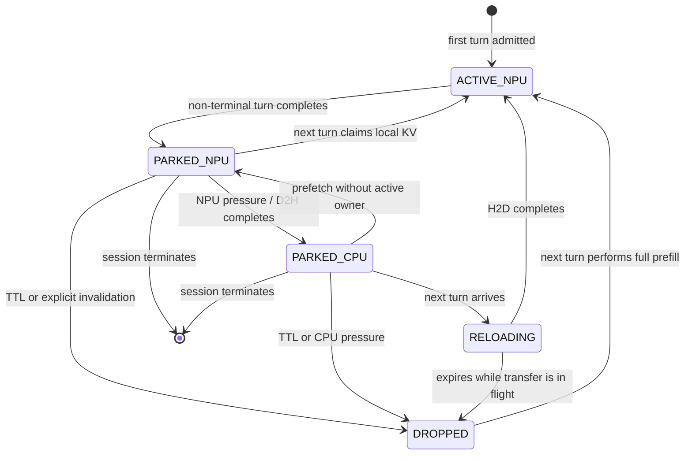

# Session KV Retention Plan

This document specifies a session-scoped KV-retention model for agentic and
multi-turn workloads. It is an implementation plan, not a description of
released simulator behavior.

The feature retains the KV state produced by one turn while the session is
paused for a tool call, agent action, or human think time. A later turn in the
same session can reuse that state without storing token IDs in the workload.
KV state is never shared across different sessions, even when their prompts
would have an identical token prefix.

The design complements CPU KV offloading: inactive session state may remain on
an NPU, move to node-local CPU memory under pressure, or be dropped and
recomputed. A configurable hard time-to-live (TTL) places an upper bound on how
long inactive state may remain reusable.

## Decision summary

The first implementation will:

- use `session_id` plus the linear sub-request dependency chain as the cache
  identity;
- require an explicit append-only context contract before inferring reuse
  without token IDs;
- keep retained session KV in the same physical NPU and node-shared CPU
  allocators used by live request KV;
- transfer ownership from a completed `Request` to a dedicated session record
  instead of copying or double-accounting the same bytes;
- prefer inactive session state as an offload victim before active decode
  requests;
- drop CPU-resident session state when CPU capacity is needed rather than
  blocking request admission;
- expire inactive state after a configurable TTL, regardless of whether it is
  resident on NPU or CPU; and
- start with colocated instances, then add a separately validated PD policy.

The existing token-prefix `RadixCache` remains a separate feature. Session KV
retention does not require a radix tree, token hashes, or cross-session prefix
matching.

## Terminology

**Turn** is one LLM sub-request in an agentic session.

**Active KV** is KV owned by a request that is currently queued, running, or
temporarily preempted while it remains eligible to generate tokens.

**Parked KV** is reusable KV owned by a session between turns. It is not a
runnable request and does not consume a sequence slot, but its bytes still
consume NPU or CPU capacity.

**Session hit** occurs when a later turn reuses parked KV from the same
`session_id`.

**Session miss** occurs when no reusable state exists, the state expired or was
dropped, or the next turn does not declare a compatible context relationship.
The next turn then performs ordinary prefill.

**Hard TTL** is the maximum time parked KV remains logically reusable. Capacity
pressure may drop it earlier; TTL is not a minimum retention guarantee.

## Why this is separate from token-prefix caching

Token-prefix caching answers: "Does any previously processed sequence share
this request's token prefix?" Correct matching requires token IDs or a
collision-resistant representation of them.

Session retention answers a narrower question: "Does this turn explicitly
continue the previous turn in the same dependency chain?" The workload already
provides this relationship through `session_id` and `sub_requests`, so it can
declare reuse without listing every token ID.

The tradeoff is deliberate:

- workload files become much smaller;
- cache identity and lifetime are deterministic;
- tenant/session isolation is explicit; but
- identical prefixes in different sessions are never shared.

This is an acceptable first model for tool-using agents and human-in-the-loop
sessions, where reuse within a long-lived session is the target behavior.

## Workload contract without token IDs

The simulator cannot infer content equality from token counts alone. A session
must therefore opt into an append-only context contract:

```json
{
  "session_id": "session-42",
  "arrival_time_ns": 0,
  "reuse_previous_kv": true,
  "session_kv_ttl_ns": 30000000000,
  "sub_requests": [
    {
      "input_toks": 1000,
      "output_toks": 100,
      "tool_duration_ns": 5000000000
    },
    {
      "input_toks": 1150,
      "output_toks": 80,
      "tool_duration_ns": 0
    }
  ]
}
```

`reuse_previous_kv: true` asserts that every later turn begins with the token
sequence represented by the previous retained KV state. No token IDs are
needed because this is a dataset contract, not a probabilistic match.

For truncation, summarization, or another context rewrite, a sub-request may
provide an explicit scalar override:

```json
{
  "input_toks": 900,
  "output_toks": 60,
  "reused_prefix_toks": 640,
  "tool_duration_ns": 0
}
```

The override is authoritative and must satisfy:

```text
0 <= reused_prefix_toks <= min(previous_cached_tokens, input_toks)
```

If neither the append-only contract nor an explicit override is present, the
turn is a session miss. The simulator must not treat equal token counts as
proof of an equal prefix.

### Reusable-token accounting

The reusable length must come from the predecessor's actual
`num_computed_tokens`, not blindly from `input_toks + output_toks`. The final
sampled output token may not yet have passed through a forward step and
therefore may not have KV state. On continuation, that token is part of the
uncached suffix and is computed together with newly added user/tool tokens.

For an append-only turn:

```text
reused_tokens = min(session.cached_tokens, request.input_toks)
prefill_tokens = request.input_toks - reused_tokens
```

Token hits remain exact while allocated bytes remain block-rounded according
to the existing memory model.

## Session record and ownership

Retained state belongs to a session record rather than to a completed request:

```text
SessionKVState
  session_id
  model_name
  sub_request_index
  cached_tokens
  bytes_per_rank
  bytes_full_cluster
  residency
  owner_node_id
  owner_instance_id
  parked_at_ns
  expires_at_ns
  last_access_ns
  migration_id
```

The record must also carry enough model and parallelism identity to reject
reuse across incompatible KV layouts. At minimum, model, KV dtype, TP size,
and block size must match.

At turn completion, ownership changes atomically:

1. finish request accounting and determine `cached_tokens` from the actual
   computed state;
2. create or update the session record;
3. transfer the existing allocation to the session record without allocating
   a second copy;
4. remove the completed request; and
5. arm or refresh the TTL.

At the next turn, the inverse transition transfers the retained allocation
from the session record to the new request. There must never be two owners for
the same bytes.

## State machine



`ACTIVE_NPU` remains request-owned. The parked and dropped states are
session-owned. CPU-resident attention is not supported: a CPU hit must reload
to NPU before any continuation compute begins.

## TTL semantics

### Configuration

The proposed controls are:

```text
--enable-session-kv-retention / --no-enable-session-kv-retention
--session-kv-ttl-ns <integer>
--session-kv-npu-victim-policy lru
```

Cluster instances may override the same fields. `session_kv_ttl_ns = 0` means
no time-based expiration, preserving an explicit opt-out. A session-level
`session_kv_ttl_ns` field may override the instance default for workload
experiments.

### Expiration point

For every non-terminal turn:

```text
parked_at_ns = turn_completion_ns
expires_at_ns = parked_at_ns + effective_ttl_ns
```

TTL refreshes only when another turn completes. Routing, lookup, eviction, or
reload must not extend the lifetime silently.

Expiration applies only to inactive session-owned state. It must never kill an
active request. Once a turn claims the state before expiry, the TTL is disarmed
until that turn completes and parks a new version.

### Hard-expiration rules

At the first simulator event where `current_time_ns >= expires_at_ns`:

- `PARKED_NPU`: free its per-rank NPU allocation and mark the record dropped;
- `PARKED_CPU`: free its full-cluster node CPU allocation and mark it dropped;
- `RELOADING` or `NPU_TO_CPU`: invalidate the logical cache immediately, let
  the synchronous backend transfer finish, then release any committed or
  reserved destination bytes without exposing a hit; and
- terminal session: free retained state immediately without waiting for TTL.

When an arrival and expiration have the same timestamp, expiration is
processed first. The arriving turn is therefore a miss. This ordering avoids
run-to-run ambiguity.

Capacity eviction is allowed before TTL. In particular, CPU pressure drops
parked state and converts a future continuation into a recompute; it must not
stall unrelated request admission merely to preserve an optional cache.

### Idle-time advancement

The main loop must treat the earliest session expiry as a simulator event. If
all instances are idle during a long human/tool pause, time advances to the
minimum of:

```text
next request arrival
next deferred sub-request release
next parked-session expiry
```

This prevents expired state from remaining charged indefinitely just because
no compute batch is running.

## Placement and eviction policy

The initial NPU victim order should be:

1. expired parked state;
2. non-expired parked sessions, using LRU by `last_access_ns`;
3. active decode requests, using the existing live-KV victim policy.

Evicting parked NPU state creates an ordinary D2H migration workload with host
link and CPU DRAM delay. It changes residency only after the workload
completes, using the same reserve-then-commit rules as active-request
offloading.

The node's `NodeCPUKVPool` is the single source of truth for both preempted
active KV and parked session KV. Records should carry an allocation kind for
metrics and victim selection, but they must not own a second capacity counter.

When CPU capacity is exhausted, the policy may discard parked session KV to
make room. Dropping cached state requires no data-transfer trace; it frees the
CPU allocation and records a future miss. Active request state must not be
dropped because it is required for correctness.

## Routing and affinity

The current agentic router already tracks deferred sub-requests, but every turn
is routed through the ordinary load-balancing policy. Session retention needs
an explicit placement record.

For colocated instances, the baseline policy is session affinity:

- the first turn uses the normal routing policy;
- later turns return to the instance that owns the retained KV;
- if the state was dropped, the router may either preserve affinity for
  determinism or route normally under a documented policy; and
- `session_id` and `sub_request_index` must be passed into the actual
  `Request`, not kept only in router metadata.

Affinity avoids an unmodeled NPU-to-NPU transfer. Cross-instance migration may
be added later, but it must have explicit capacity, delay, and ownership
transitions.

## Prefill/decode disaggregation

PD continuation is not equivalent to colocated reuse. A completed turn's KV is
owned by the decode instance, while new context tokens normally execute on a
prefill instance. Reuse therefore requires a decode-to-prefill path before the
existing prefill-to-decode handoff.

The implementation considered these policies rather than treating the move as
free:

1. support session retention only for colocated instances;
2. park PD session state in node CPU after each turn, then reload it into the
   selected prefill instance on continuation; or
3. add a timed same-node NPU-to-NPU reverse handoff.

Step 6 implements policy 2. Every non-terminal decode turn performs a modeled
D2H park into the node-shared CPU pool. Its affinitized prefill instance adopts
that CPU record and performs a modeled H2D reload before suffix prefill. The
policy requires session retention and CPU KV offloading on every same-node PD
instance. Cross-node session continuation remains unsupported.

## Scheduler integration

Session records must not remain in `Scheduler.request`, because a paused
session is not runnable and must not consume `max_num_seqs`. A session store
should instead expose operations such as:

```text
park_completed_turn(request, completion_time_ns)
claim_for_turn(session_id, request, current_time_ns)
select_npu_victims(required_bytes, current_time_ns)
drop_cpu_victims(required_bytes, current_time_ns)
expire_due(current_time_ns)
next_expiry_ns()
```

Admission for a continuation follows the retained state:

- NPU hit: claim ownership and allocate only blocks needed for the uncached
  prompt suffix;
- CPU hit: reserve NPU capacity, run a migration-only H2D workload, claim
  ownership after completion, then compute the suffix;
- miss: run ordinary prefill for the complete input; and
- partial scalar override: retain or reload only the declared reusable prefix,
  release excess cached blocks, then compute the remaining input.

All reservations, commits, cancellations, and TTL invalidations must preserve
the invariant that NPU and CPU usage never becomes negative or exceeds
capacity.

## Interaction with existing RadixCache

The initial session-retention mode should be mutually exclusive with generic
token-prefix caching on the same instance. This keeps hit accounting and KV
ownership unambiguous while the new lifecycle is validated.

Unlike the current rejected combination of CPU offloading and CPU prefix
caching, session retention may be enabled with CPU offloading because both
features operate on the same retained live-KV objects and the same
`NodeCPUKVPool`. There is no second CPU cache allocator.

A later combined mode may look up session state first and then use RadixCache
for the uncached suffix or for cross-session hits. That composition is out of
scope for the baseline.

## Metrics and output

Extend the instance-level KV-offload sidecar or add a session-specific sidecar
with at least:

- session NPU hit count and hit tokens;
- session CPU hit count, hit tokens, reload bytes, and reload time;
- miss count and recomputed prompt tokens;
- TTL-expiration count and bytes freed by tier;
- capacity-drop count and bytes freed;
- parked NPU and CPU byte-time;
- peak parked bytes by tier;
- continuation wait caused by reload;
- number of sessions currently parked; and
- terminal-session cleanup count and bytes.

Session hits must remain distinct from cross-session prefix-cache hits. D2H/H2D
bytes must also remain distinguishable from same-node PD ownership transfers.

## Failure and edge cases

The implementation must define deterministic behavior for:

- duplicate active turns for one session: reject because the baseline is a
  linear dependency chain;
- a continuation that arrives after TTL: full-prefill miss;
- a continuation that arrives while D2H is in flight: wait for completion or
  cancel logically and reclaim on NPU, with no duplicate owner;
- TTL during H2D: complete physical cleanup but expose no cache hit;
- CPU capacity exhausted: drop optional parked state before failing active KV
  admission;
- incompatible model, KV dtype, TP size, or block size: invalidate and
  recompute;
- context truncation inside a block: use exact hit tokens but block-rounded
  memory accounting;
- session termination while state is migrating: invalidate immediately and
  release reservations at transfer completion; and
- simulator idle during a long pause: advance to expiry or next release
  without busy-looping.

## Validation matrix

| Scenario | Expected result | Step 7 gate |
| --- | --- | --- |
| One append-only continuation, NPU fit | Reuse predecessor KV; compute only the uncached suffix; no migration | Unit + bundled colocated E2E pass |
| Same input length in two sessions | No sharing; both first turns run full prefill | Cross-session ownership unit test passes |
| Continuation after D2H eviction | One D2H and one H2D; reuse only after reload completion | CPU round-trip unit + PD E2E pass |
| CPU pressure drops parked state | Future continuation is a full-prefill miss; active request state remains intact | Node-wide pressure unit test passes |
| Continuation before TTL | Hit and TTL is disarmed while the turn is active | Boundary unit test passes |
| Continuation exactly at TTL | Expiration wins; full-prefill miss | Boundary unit test passes |
| Continuation after TTL | State is already freed; full-prefill miss | Boundary unit test passes |
| Idle simulator until TTL | Clock advances to expiry and frees capacity without a compute batch | Idle-event unit + bundled TTL E2E pass |
| TTL during migration | No reusable state or leaked reservation after transfer completion | D2H and H2D expiry unit tests pass |
| Explicit `reused_prefix_toks` | Reuse exactly the declared token count; free any excess retained blocks | NPU and CPU partial-hit unit tests pass |
| Final session turn | Retained KV is freed immediately, not at TTL | Terminal cleanup unit test passes |
| Different KV layout in same session | Reuse rejected and state invalidated | Layout-mismatch unit test passes |
| Same-node PD continuation | Decode D2H park followed by prefill H2D reload; suffix compute begins only after reload | CPU-bridge unit + zero-wait PD E2E pass |
| Cross-node PD continuation | Rejected before ownership or capacity changes | Cross-node handoff unit test passes |

Each focused run should assert token counts, per-rank and full-cluster bytes,
residency, ownership, expiry ordering, migration traces, TTFT impact, and final
zero leaked reservations.

### Reproducible Step 7 gates

Run the focused suite from the repository root:

```bash
python -m unittest discover -s tests -v
```

The public [agentic-session guide](/docs/workloads/agentic-sessions#runnable-session-retention-examples)
records the three bundled E2E commands for colocated NPU reuse, TTL expiry, and
the zero-wait same-node PD CPU bridge. They use:

- `configs/cluster/single_node_session_kv_retention.json`;
- `configs/cluster/single_node_pd_session_kv_retention.json`;
- `workloads/example_session_retention.jsonl`; and
- `workloads/example_session_retention_zero_wait.jsonl`.

For implementation changes, rebuild ASTRA-Sim with `scripts/compile.sh` before
running the E2E gates so the host-link timing code and Chakra converter match
the Python frontend.

## Implementation steps

| Step | Status | Validation gate |
| --- | --- | --- |
| 0. Approve the session contract, state machine, TTL semantics, and PD scope | Complete | This document is accepted |
| 1. Propagate session metadata and add `SessionKVState` ownership | Complete | Completion parks KV without copying or freeing it; terminal cleanup frees it |
| 2. Add colocated NPU session hits | Complete | Append-only continuation computes only the suffix; cross-session reuse is impossible |
| 3. Integrate parked state with the shared CPU offload allocator | Complete | Parked D2H/H2D traces include host-link delay and preserve atomic ownership |
| 4. Add hard TTL and idle-time expiry events | Complete | Before/equal/after-expiry and in-flight-expiry cases pass without leaks |
| 5. Add drop-on-CPU-pressure policy and metrics | Complete | Optional state is dropped before active correctness state; sidecar accounting matches bytes |
| 6. Add and validate an explicit PD continuation policy | Complete | No decode-to-prefill ownership move is free or implicit |
| 7. Run the end-to-end agentic validation matrix and publish user documentation | Complete | Full matrix, output schema, and reproducible commands are recorded |

### Progress log

- 2026-07-20: Approved Step 0 and completed the Step 1 ownership
  foundation. Agentic session identity, turn index, continuation contract,
  optional reuse-token override, TTL, and terminal-turn metadata now reach the
  actual `Request`. Colocated schedulers can atomically transfer a completed
  non-terminal turn's existing NPU allocation to `SessionKVState` without a
  copy or free, while terminal cleanup releases both current and stale parked
  state. Router affinity keeps enabled sessions on their original colocated
  scheduler. Invalid negative scalar fields and duplicate session ids are
  rejected before state creation. The full focused suite passed 42 tests at
  this step. The feature remained internal until Step 2 added the runtime
  configuration and continuation-hit admission path.
- 2026-07-20: Completed Step 2. Added the
  `--enable-session-kv-retention` runtime and per-instance setting with clear
  rejection of generic prefix caching, CPU KV offloading, and PD combinations
  that are not implemented yet. A compatible continuation atomically claims
  its session's parked NPU allocation, initializes `num_computed_tokens` from
  the retained state, and computes only the uncached suffix. Explicit partial
  reuse frees excess retained blocks; expired, incompatible, zero-reuse, or
  undeclared states become full misses. Sessions remain affinitized to one
  colocated scheduler and cannot claim another session's state. The full suite
  passes 48 tests. A preserved two-turn ASTRA-Sim run uses 10 prompt tokens in
  turn 0, retains 13 computed KV tokens, and emits a 2-token prefill for turn
  1's 15-token input. Both turns complete with all 8 output tokens, and final
  NPU KV usage returns to the model-weight baseline.
- 2026-07-20: Completed Step 3. Parked NPU session state is now considered
  before active requests under watermark pressure and migrates through the
  same node-shared `NodeCPUKVPool`. D2H and H2D use migration-only ASTRA-Sim
  workloads, with source ownership changing only after destination reservation
  and transfer completion. A CPU-resident continuation reserves NPU capacity,
  reloads, then computes only its suffix. Reservation failure leaves the
  original owner and residency intact. The full suite passes 52 tests,
  including partial CPU-hit cleanup of the larger source allocation. A
  preserved three-request ASTRA-Sim run evicts and reloads 2 MiB, reports zero
  active-request preemptions and one 33,648 ns reload stall, then emits a
  2-token continuation prefill and returns NPU KV usage to the model-weight
  baseline.
- 2026-07-20: Completed Step 4. Added the global and per-instance
  `session_kv_ttl_ns` default while preserving a per-session workload
  override. The main loop now treats the earliest parked-state expiry as a
  first-class event and processes expiration before equal-time arrivals and
  migration completions. NPU- and CPU-resident state is released immediately.
  D2H/H2D state is invalidated logically at expiry and cleaned physically when
  the synchronous migration completes; an expired H2D or queued CPU
  continuation falls back to full prefill. The full suite passes 60 tests. A
  preserved idle ASTRA-Sim
  run expires 2 MiB of NPU KV 20 ms after turn completion, advances through a
  100 ms tool pause, and emits a full 15-token prefill rather than the 2-token
  cached suffix. Both turns generate all 8 output tokens and final KV usage
  returns to the model-weight baseline.
- 2026-07-20: Completed Step 5. `NodeCPUKVPool` now keeps a node-wide registry
  of CPU-resident parked sessions. Before an active request or new parked
  session fails CPU admission, it drops LRU optional session records until the
  reservation fits; correctness-owned active KV is never discarded. Pending
  continuations whose record is dropped revert atomically to full prefill.
  The existing sidecar now reports session NPU/CPU hits and tokens, misses and
  recomputed tokens, session reload bytes/time, TTL frees by tier, capacity
  drops, byte-time and peak occupancy, reload wait, current parked sessions,
  and terminal cleanup. A focused cross-scheduler pressure test confirms that
  node-wide LRU reclamation drops only optional parked state, admits active KV,
  and turns the dropped session's next continuation into a measured miss.
- 2026-07-20: Completed Step 6 with the explicit CPU-bridge PD policy. A
  non-terminal decode turn must complete a D2H migration before its state is
  parked. The same-node affinitized prefill instance adopts the shared CPU
  record, completes H2D, and only then computes the uncached suffix. Every PD
  instance on the node must enable both session retention and CPU KV
  offloading; cross-node reuse remains rejected. A migration-only prefill trace
  places the real host-memory operation on the physical NPU graph and a 1 ns
  synchronization node on the paired logical sender graph, so the transfer is
  counted once while both streams advance to suffix prefill. The full suite
  passes 64 tests. A preserved zero-think-time two-turn PD ASTRA-Sim run emits
  one 2 MiB D2H workload in 33,648 ns and one 2 MiB H2D workload in 33,649 ns,
  records one CPU session hit for 13 tokens and zero misses, prefills only the
  2-token suffix of the second 15-token input, completes two ordinary forward
  PD handoffs, generates all 8 output tokens, and returns both instances and
  the shared CPU pool to their baselines.
- 2026-07-20: Completed Step 7. The focused suite now passes 68 tests and names
  every validation-matrix boundary explicitly, including before/equal/after
  TTL, incompatible KV layout, and duplicate session ids. Added bundled
  colocated and same-node PD cluster configs plus normal-wait and zero-wait
  session workloads. With a freshly rebuilt ASTRA-Sim, the colocated E2E
  records one 13-token NPU hit; the 20 ms TTL E2E records one expiration, one
  miss, 2 MiB freed, and 15 recomputed prompt tokens; and the zero-wait PD E2E
  records one 13-token CPU hit, a 2 MiB D2H in 33,648 ns, a 2 MiB H2D in
  33,649 ns, and two 2 MiB forward PD handoffs. All runs finish with no parked
  session state or memory reservations. The public workload, configuration,
  CLI, and output guides document the supported scope and sidecar metrics.
- 2026-07-20: Final-review fixes make CPU hit accounting transactional. A CPU
  claim is provisional until H2D completes; TTL or capacity fallback records
  one full-prefill miss instead of leaving a false hit. Reload wait now spans
  continuation arrival through NPU usability, and a bridge-blocked PD session
  no longer head-of-line blocks unrelated arrived requests. The focused suite
  passes 69 tests after these regressions were added.

## Out of scope for the baseline

- cross-session prefix sharing;
- token-ID or content-hash matching;
- branching sessions with multiple simultaneous child turns;
- asynchronous transfer/compute overlap;
- speculative prefetch based on known future tool duration;
- partial attention over CPU-resident KV;
- CXL session storage; and
- distributed session KV across nodes.
