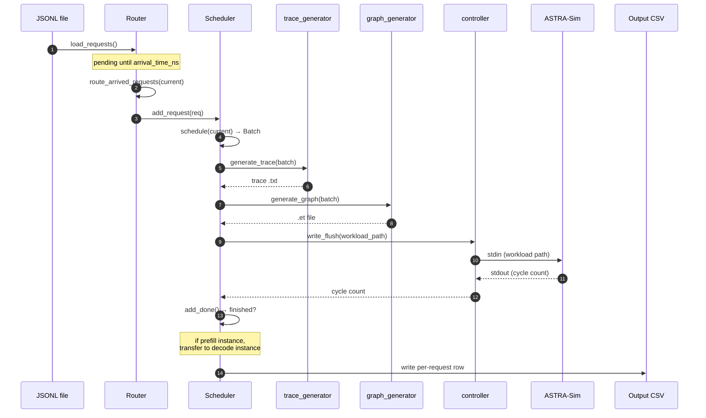

# Request lifecycle

This page follows a single request from the JSONL file all the way to
its row in the output CSV. Same main loop as
[Architecture overview](./architecture), but from the request's
perspective.

> Need the *configuration* angle (how to enable each feature)?
> See **[Examples](/docs/examples)**.



## Stage 1, Loaded into the Router

When `python -m serving --dataset workloads/foo.jsonl` starts up,
`router.load_requests()` parses the JSONL line by line and builds
`Request` objects:

```python
class Request:
    id: int
    model: str
    arrival_time_ns: int
    input_tokens: int        # prompt length
    output_tokens: int       # max decode length
    instance_id: int | None  # set on routing
    pd_type: str | None      # "prefill" or "decode" once routed
    session_id: str | None   # for agentic sessions
    sub_request_index: int   # 0 for flat, increments for sub-requests
    input_tok_ids: list[int] | None   # for prefix caching
    # ...metrics filled in later: ttft_ns, first_token_time_ns, etc.
```

Two formats supported in the same file:

- **Flat:** one JSONL entry = one independent request.
- **Agentic sessions:** one JSONL entry = one session with multiple
  chained sub-requests. Only the first sub-request is enqueued; the
  rest live in `Router._deferred_sessions` until released.

Requests with `arrival_time_ns > 0` are **not** routed yet, they
land in `Router._pending_requests`, sorted by arrival time.

## Stage 2, Waiting for arrival time

The simulator clock (`current` in `__main__.py`, in ns) marches
forward as ASTRA-Sim returns cycle counts. Once `current >=
request.arrival_time_ns`, `router.route_arrived_requests(current)`
pulls the request out of `_pending_requests`.

If all instances are idle but there are pending requests in the
future, `__main__.py` advances `current` directly to the next pending
arrival time to avoid busy-looping.

## Stage 3, Routed to an instance

The router applies its policy (`--request-routing-policy`):

| Policy | Behavior |
| --- | --- |
| `LOAD` (default) | vLLM-style: pick instance with smallest `waiting * 4 + running` score |
| `RR` | Pure round-robin |
| `RAND` | Random uniform |
| `CUSTOM` | Pluggable in `serving/core/router.py` |

For **prefill/decode disaggregation**, the router only considers
prefill instances at this stage. Decode instances receive the
request later via `transfer_prefill_request`.

Once routed, the request goes into the chosen
`Scheduler`'s waiting queue (`scheduler.add_request(req)`).

## Stage 4, Picked up by the scheduler

Each iteration, `scheduler.schedule(current, sys)` decides which
requests to include in the next `Batch`. The constraints:

- `len(batch) <= --max-num-seqs` (sequence count cap)
- `sum(tokens_to_run) <= --max-num-batched-tokens` (token budget)
- per-request `tokens_this_step <= --long-prefill-token-threshold`
  *(if set, gates chunked prefill)*

There are two scheduling paths:

- **Without prefix caching** (`schedule_base`): pure FIFO + token
  budget.
- **With prefix caching** (`schedule_with_prefix`): same plus
  RadixCache lookup that returns `hit_len` for each request.

The full mechanics are on
**[Continuous batching](./scheduling/continuous-batching)**.

## Stage 5, Wrapped in a Batch

`Batch` aggregates the chosen requests:

```python
class Batch:
    batch_id: int
    instance_id: int
    fired: list[bool]    # one entry per NPU; only first NPU emits trace
    total_len: int       # sum of tokens this iteration
    kv_len: int          # sum of KV-cache tokens after this step
    hit_len: int         # sum of prefix-cache hits across requests
    num_prefill: int
    num_decode: int
    q_list: list[int]    # query lengths per request
    k_list: list[int]    # KV lengths per request
    # ...
```

The `fired` list ensures multi-NPU instances only generate the trace
once (on rank 0); other ranks just read back the cycle count.

## Stage 6, Trace generated

`trace_generator.generate_trace(batch, hardware, tp_size, ...)` walks
the model's architecture YAML and looks up per-layer latencies in the
profile DB:

- Dense layers (qkv, mlp, etc.) → 1D linear lookup over `total_len`.
- Per-sequence layers (`lm_head`, `sampler`) → 1D over
  `num_requests`.
- Attention → 4D nearest-neighbour + bilinear over
  `(prefill_chunk, kv_prefill, n_decode, kv_decode)`. Skew correction
  blends two lookups using a per-bucket `alpha`.
- MoE → 2D over `(local_tokens, activated_experts)`, profiled at
  TP=1.

In compatibility or oracle execution, the output is a tab-separated text trace at
`astra-sim/inputs/runs/<run_id>/trace/<hw>/<model>/instance_{i}_batch_{b}.txt`.
The text trace is an intermediate input to the Chakra converter and is
removed after the `.et` graph is generated unless `--no-cleanup-inputs`
is set. With analytical IPC/direct enabled, after a structure has been
registered, matching batches remain as structured in-memory records and do
not create the per-batch text file.
Full mechanics on **[Trace generation](./trace-generation)**.

## Stage 7, Converted to Chakra graph

`graph_generator.generate_graph` calls Chakra's text-to-protobuf converter
in the serving Python process by default, producing
`astra-sim/inputs/runs/<run_id>/workload/<hw>/<model>/instance_{i}_batch_{b}/llm.et`.
Chakra workloads remain available while ASTRA-Sim consumes them; the
run directory is removed after a successful simulation unless
`--no-cleanup-inputs` is set.

Use `--chakra-converter subprocess` to retain the legacy one-process-per-graph
reference path. Both modes produce the same Chakra workload format; this
option changes host overhead, not simulated behavior.

The analytical backend uses `--workload-transport ipc` by default. It sends
framed protobuf messages over a run-specific Unix-domain socket and performs a versioned `HELLO`
handshake. IPC startup registers the event-handler Chakra bundle, and the first
independent compute batch per instance bootstraps a static compute template.
ASTRA-Sim parses these graphs into immutable nodes, child adjacency, and
initial dependency counts. It also validates that two independent iteration
states can traverse the graph without modifying the template, then returns
stable template ids. For independent compute batches, Python now sends a
`BatchPatch` first and ASTRA-Sim applies it to a fresh iteration state. The
default `--ipc-execution direct` path installs that state into the existing
compute, communication, and memory issue engine without sending the `.et`
path. `--ipc-execution oracle` materializes and converts each batch, extracts
all dynamic values from that full graph, and submits them through the same
prepared execution engine. This isolates direct-patch correctness from legacy
stdin event-order differences. Colocated TP/PP, local-EP MoE, PIM attention, CPU KV
migration, and prefill/decode workloads materialize one graph bundle per
distinct trace structure to bootstrap and validate a shape-keyed template.
Prefill templates atomically include both the physical prefill graphs and the
paired decode-side receive graphs. Later matching batches derive patches from
the in-memory trace values and skip both the trace-file write and Chakra
conversion. DP/EP groups build one patch per real or dummy participant and
submit the complete set with atomic `RUN_WAVE`. ASTRA-Sim validates every
participant before installing any runtime state, then launches the full wave
and returns correlated `BATCH_DONE` events. The frontend keeps an LRU-bounded
shape cache and records class-specific hits, misses, registrations, and
evictions in the host-timing output.

When every simulated system is idle during an agent tool call, Python sends an
explicit `ADVANCE_TIME` message before releasing the next turn. ASTRA-Sim does
not infer simulated time from host-side graph-generation or IPC latency.
The direct stdout drain retains only a bounded diagnostic tail, so long runs do
not accumulate backend log lines in the Python frontend. Lifecycle RSS
checkpoints are included in host-timing JSON. ns-3 remains on file transport
because it does not yet implement this protocol; analytical users can also set
`--workload-transport file` explicitly for compatibility or graph debugging.

The Chakra converter creates:

- `MEM_LOAD_NODE` for the first layer's input (CPU → NPU).
- `COMP_NODE` for each computation layer.
- `MEM_STORE_NODE` for the last layer's output (NPU → CPU).
- `COMM_COLL_NODE` for ALLREDUCE / ALLTOALL collectives, with
  optional `involved_dim` BoolList for multi-dimensional topologies.

## Stage 8, Submitted to ASTRA-Sim

File transport sends the workload path over stdin, while direct IPC installs
the prepared iteration in memory. Both paths use the same ASTRA-Sim compute,
communication, and memory issue logic. File mode emits:

```
Waiting <sys=0> id=42 cycle=178654321
```

`controller.read_wait` blocks until that line appears. Direct IPC instead
waits for a structured `BATCH_DONE` message, avoiding repeated `PASS` polling.

For **DP groups**, use IPC oracle or direct execution. The legacy file control
path is rejected because it cannot atomically install every collective
participant. Direct IPC carries the same
static stream IDs in registered templates and atomically installs all
participants through `RUN_WAVE`, including dummy participants for idle ranks.

## Stage 9, Marked done

`scheduler.add_done(npu_id, sys, current)` consumes the cycle count:

- Updates per-request running totals (cycles spent in this iteration
  attributed to each request based on `q_list`).
- For requests that finished decoding this step
  (`request.num_computed_tokens >= request.input + request.output`):
  records `last_token_time_ns`, computes `latency_ns`, marks done.
- Returns `(prompt_throughput, decode_throughput, finished_requests)`
  to the main loop.

For prefill instances (`pd_type="prefill"`), finished requests are
**transferred** to a decode instance via
`router.transfer_prefill_request`. The KV cache transfer cost is
modeled as inter-link bandwidth based on KV size.

## Stage 10, Output

Once all requests finish (and no agentic sub-requests are deferred),
the simulator writes the per-request CSV at the path you passed via
`--output`. One row per request:

```
request_id, arrival_ns, first_token_ns, last_token_ns,
prompt_toks, decode_toks, ttft_ns, tpot_ns, latency_ns,
prefix_hit_len, npu_cache_hit, storage_cache_hit, instance_id,
session_id, sub_request_index
```

(Exact columns depend on the version. Validation methodology and
column-by-column interpretation live on
**[Reading the output](./reading-output)**.)

## Agentic sessions: when stage 10 is not the end

For agentic JSONL entries (sessions with `sub_requests`), finishing
sub-request *N* triggers `router.notify_request_completed`, which:

1. Schedules sub-request *N+1* with arrival time =
   `completion_time + tool_duration_ns`.
2. Inserts it into `_pending_requests` (sorted by arrival).
3. Goes back to **Stage 2** for that sub-request.

`Router.has_deferred_sessions()` keeps the main loop from exiting
early while sessions are still in flight.

## What's next

- **[Continuous batching](./scheduling/continuous-batching)** -
  Stage 4 in detail.
- **[Trace generation](./trace-generation)**: Stage 6 in detail.
- **[Parallelism mechanics](./parallelism-mechanics)**: what
  happens at Stages 7-8 for TP / EP / DP+EP setups.
